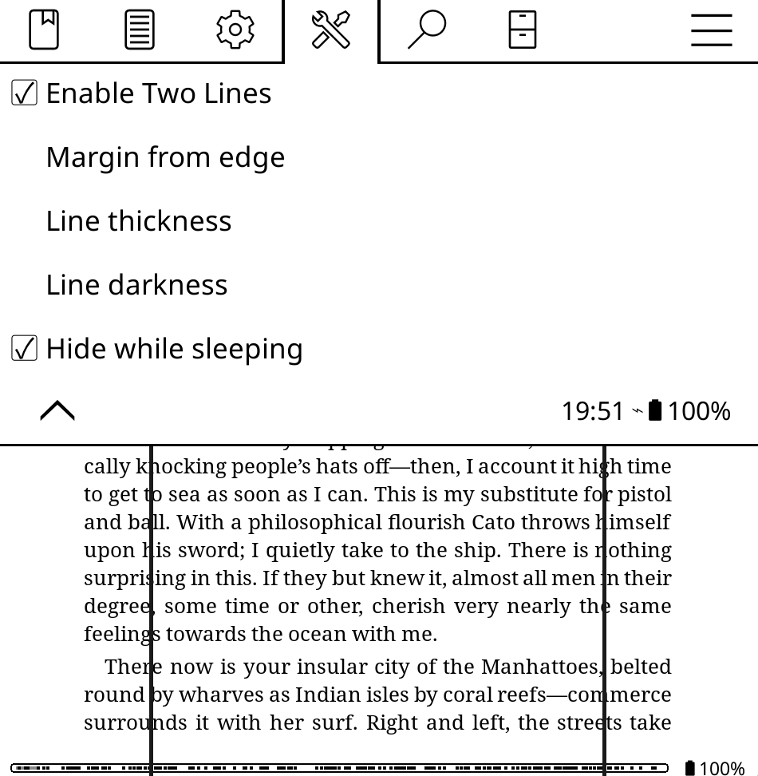

# Two Lines

**Two Lines** is a [KOReader](https://koreader.rocks/) plugin intended for speed reading. It draws two vertical guide lines near the left and right edges of the screen, giving your eyes a fixed visual lane to track within as you read.


## Features

- Two vertical lines drawn a set % in from each screen edge (adjustable)
- Adjustable line **thickness** and **darkness**
- One-tap **enable/disable** toggle from the Tools menu
- Optional: automatically **hide the lines while the device is asleep**, suspended, or in standby
- Settings persist between reading sessions

## An advice on speed reading

Guide lines like these are supposed to be an aid for speed reading, a technique that tries to lean more on peripheral vision, giving your eyes a fixed space so you take in wider chunks of text at once instead of scanning word by word across the full line width.

Speed reading tends to work best for information-dense, skimmable material where the goal is pulling out facts quickly, but the comprehension can be lost in the process, so it works less well for fiction and other prose meant to be savored, where pacing, voice, and description are part of the experience, and not just the information. Even well-known speed readers, like Howard Berg, have said they don't apply speed reading to everything they read, since it's easy to trade enjoyment for speed. So if you try this, it's worth being deliberate about *what* you use it on, not just how fast you can go.

I made this for myself, to try the technique out. Before making this plugin, I was literally taping pieces of string onto my e-reader as physical guide lines. 


At the end of the day, its just two dumb lines being drawn on top of the book, but just wanted to give you this little advice on speed reading!

## AI usage disclosure
 
I vibe-coded this plugin with Claude for myself. I'd never built a KOReader plugin before and wanted to see how it's done, so if something behaves strangely, that's probably why. I also didn't want to sink a ton of effort into what's basically drawing two lines on a screen, but wanted to share it in case it's useful to someone else.


## Installation

1. Create a folder named `twolines.koplugin` inside your KOReader `plugins/` directory (on most devices this is at `koreader/plugins/`).
2. Copy `main.lua` and `_meta.lua` into that folder.
3. Restart KOReader.

```
koreader/
└── plugins/
    └── twolines.koplugin/
        ├── main.lua
        └── _meta.lua
```

## Usage

Open a book, then go to **Tools → More tools → Two Lines**.

| Option | What it does |
|---|---|
| **Enable Two Lines** | Turns the guide lines on/off |
| **Margin from edge** | How far in from each screen edge the lines sit, as a % of screen width (5–40%) |
| **Line thickness** | Line width in pixels (1–20) |
| **Line darkness** | Shade from light gray (1) to solid black (10) |
| **Hide while sleeping** | When on, lines disappear while the device is asleep, suspended, or in standby, and reappear on wake (on by default) |


Changes apply immediately and are saved automatically the next time KOReader flushes settings (closing the book, suspending the device, etc.).




## Notes

- This plugin is `is_doc_only = true`, so it only loads while a document is open — it won't appear in the file browser view.